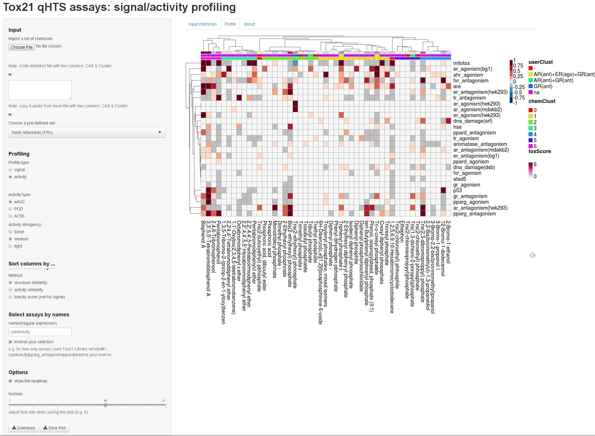

ActivityProfilingGUI
====================

A R Shiny interface to explore Tox21 activity profiling data

Usage
-----

demo: [http://spark.rstudio.com/moggces/profiling/](http://spark.rstudio.com/moggces/profiling/)

or

- download the files in GitHub
- extract the zip file in a folder and make the folder as working directory 
- library(shiny)
- runApp()

Input
-----
A tab-delimited file with two columns or copy&paste from excel
Column names: *CAS* and *Cluster* (examples can be found in the example folder)

Paramenters
-----------
1. profile type
* signal: the responses observed the assays
* activity: the signal that is biologially relevant.

2. Activity type
- wAUC (weigthed area under the curve)
- POD (point-of-departure)
- AC50 (half-maximal response concentration)

3. Sort columns by ...

the columns of heat map can be sorted by chemical similarity, activity similarity, or toxscore, which is the column sum of normalized wAUC or POD/AC50 weighted by wAUC

4. Select assays by names

example#1: mitotox|er_antagonism|ar_antagonism(mdakb2)|aromatase|are
example#2: cytotoxicity|pparg_antagonism|ppard|are|hse + inverse

5. wAUC threshold for plotting

It only works in POD/AC50 mode. It classifis the POD/AC50 into two bins and color them respectively in the heat map. Brown: wAUC < threshold; Green: wAUC >= threshold

Heatmap
-------

* The color represents the strength. The darker color, the stronger the response. The gray color represents the inconclusive activity or untested.
* The direction shows the direction (decreasing/increasing) of signal in the assay. Only positive direction is shown for the Heatmap of activity (except the mitochondrial toxicity assay)
* The *** suggests the incongruent results between sources (usually at least one source is inactive)
* The first row of annotation shows the toxscore
The second (first in signal plot) row of annotation shows the user's defined Cluster
* The third (second in signal plot) row of annotation shows cluster information by chemical similarity (cutoff=0.7) automatically generated based on the input Tox21 chemicals. 0 is for the singleton 
* The heat map is clustered using Euclidean distance and average linkage in hierachical clustering